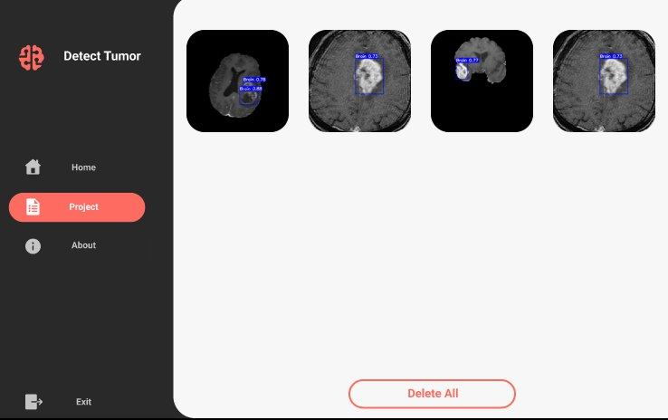
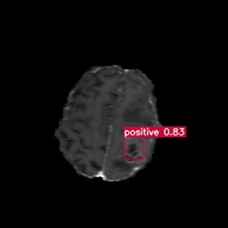

# tumor-brain-detection
 tumor brain detection with python   YOLOv5 

## Image

<div style="display: flex; flex-wrap: wrap; align-Items:center;justify-content:center;">

  
  
  
  
  
  
</div>

## Image Detected
 




## install Package
```
pip install -r requirements.txt
```
## How to run
- Run ``` pip install -r requirements.txt ```
- Run main.py

## Questions
Email For questions 

mohammedaghaei401@gmail.com
